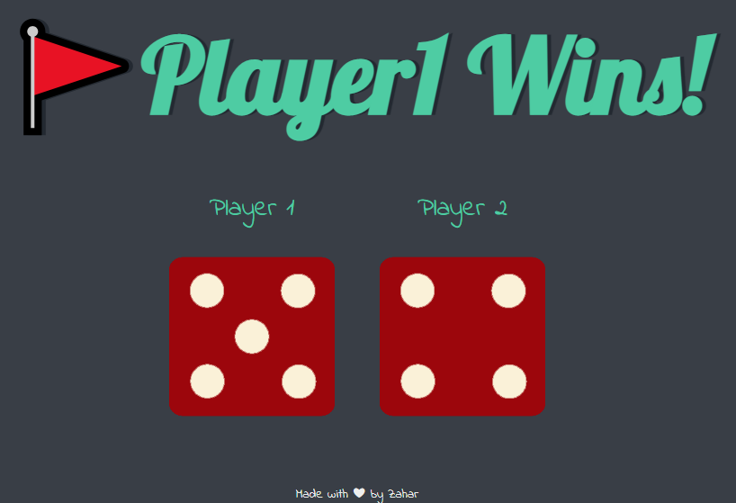

<h3>Visit the Site</h3>:https://zaharsm.github.io/dice/ 

<h3>Information </h3>: This Projects is done using Javascript + DOM  

  
<h3>Features </h3>:   
This game randomly selects the winner between 2 Players backend Math.random is used with DOM  

<h3>Tech Stack </h3>:  
1) JavaScript
2) Document Object Manipulation
 

  

 
